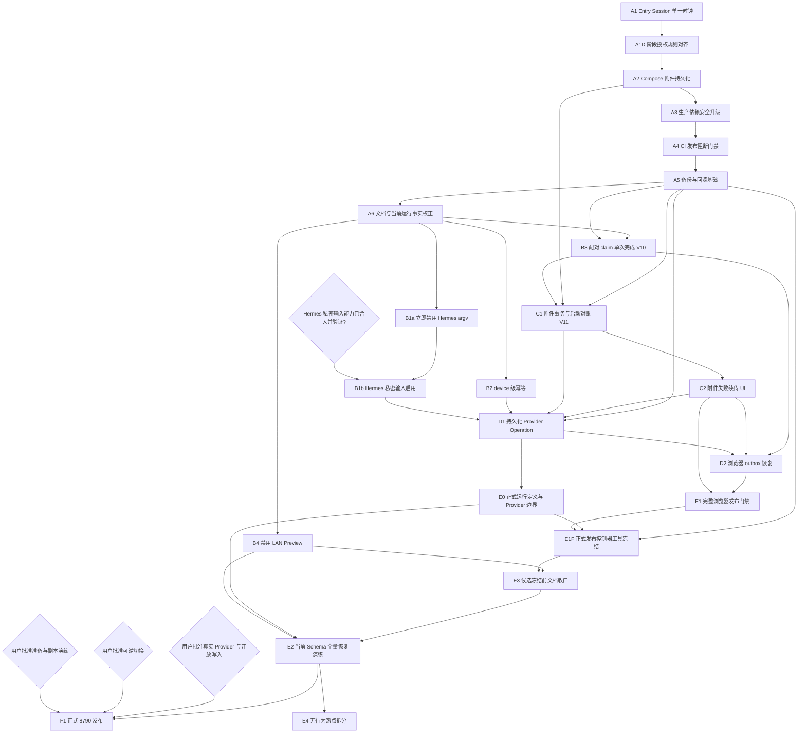

# Family AI Platform 深度 Review 整改实施总计划

> **For agentic workers:** REQUIRED SUB-SKILL: Use `superpowers:subagent-driven-development` (recommended) or `superpowers:executing-plans` to implement this plan task-by-task. Steps use checkbox (`- [ ]`) syntax for tracking.

**Goal:** 把 2026-08-13 深度 Review 发现的发布阻断、安全缺口、失败恢复缺口和文档漂移，拆成其他 Agent 可以从最新 `main` 独立领取、直接开发、独立验证和独立回滚的任务。

**Architecture:** 保持单 Gateway、单 SQLite、模块化单体；先恢复可测试、可构建、可启动的可信基线，再加固身份与隐私，随后补齐附件/客户端/Provider 的持久化恢复，最后建立 CI、保留数据发布和正式 `8790` 升级能力。每个行为任务使用独立分支和直接指向 `main` 的 PR，不堆叠 PR，不把 Preview 证据当成正式部署事实。

**Tech Stack:** Node.js 22、TypeScript、Fastify 5、Vitest、better-sqlite3、原生浏览器 JavaScript、Docker Compose、Bash、Hermes/Codex CLI Provider Adapter。

---

## 0. 使用本计划的强制规则

### 0.1 任务领取与分支

- [ ] 先读根 `AGENTS.md`、根 `README.md`、`apps/gateway/README.md`、本计划以及目标任务引用的设计文档。
- [ ] 用 Codebase Memory 的 `search_graph`、`trace_path`、`get_code_snippet` 做代码发现；只有查字符串、配置或图谱不足时才使用 `rg`。
- [ ] **在创建任务分支或修改任何文件之前**，先实时刷新远端 refs；若本机网络/权限不允许 `git fetch --all --prune`，改用 GitHub 远端查询核对 `main`、提交和祖先关系，禁止把陈旧的本地 `origin/main` 当成远端事实。
- [ ] 确认当前 `main`、远端 `main` 和工作树状态；现有用户改动不得被清理、覆盖或混入任务。
- [ ] 如果本地 `main` 领先远端 `main`，列出所有领先提交，并逐个证明它们已经是远端 `main` 的祖先；无法证明时立即阻断任务，不创建分支、不开始修改、不建 PR，也不得从旧远端基线绕开这些提交。
- [ ] 从当时最新 `main` 创建独立 `codex/<task-name>` 分支；一个任务一个直接指向 `main` 的 PR，禁止堆叠。
- [ ] 下游任务只有在依赖任务已经合入 `main` 后才可开始；如果必须并行，只允许彼此无文件冲突、无 Schema 依赖、无行为依赖的任务。
- [ ] 不执行 `git reset --hard`、`git checkout --`、force push、清空 `.runtime` 或部署正式服务。

建议的每个任务开场检查：

```bash
git status --short --branch
git rev-parse HEAD
git merge-base HEAD main
npm ci
```

2026-08-13 当前特殊基线：本地 `main`/本任务基线 `e73d873` 比本地缓存的 `origin/main=e2aba59` 领先 `00fad03`、`e73d873` 两个 Personal Agent display-name 文档提交。该缓存不能证明远端实时状态。任何后续任务在创建分支/修改文件前，必须刷新或远端查询并证明这两个提交已进入远端 `main`；否则停止并请求维护者先统一基线。

### 0.2 测试与证据

每个行为修改严格执行：

```text
新增或调整测试 → 只运行该测试并观察预期失败 → 最小实现 → 聚焦测试通过
→ 相关领域回归 → npm run check → 构建/运行级验证 → 文档同步 → 独立复审
```

- [ ] RED 必须因为目标缺陷失败，不能是语法错误、fixture 错误或环境缺失。
- [ ] 每次 GREEN 先运行最小测试集，再运行该任务列出的相关回归。
- [ ] 完成报告必须记录测试文件数、通过/失败/跳过用例数和每个未执行门禁的原因。
- [ ] 只有最新命令输出可以支撑“通过”“已修复”“可发布”等结论。
- [ ] 涉及 SQLite/附件/进程的任务必须验证重启恢复或补偿路径，不能只测正常路径。
- [ ] A2 合入后，每个行为 PR Ready 前除任务聚焦命令外，必须最新运行 AGENTS 的五项门禁；dev-up/acceptance 使用 A2 定义的隔离 runtime、唯一 project 和随机 127.0.0.1 端口，禁止碰正式 8790。A4 合入前 Docker 门禁仍使用当时 AGENTS 的 `docker compose build`；A4 合入并由 A1D/A4 同步门禁后，可交付镜像只能用 `build-gateway-image.sh --source-commit <exact-head> --expected-source-commit <trusted-exact-head>` 生成，裸 Compose build 只允许做不被后续消费的 Dockerfile smoke。文档-only PR 仍按 AGENTS/任务定义执行适用静态门禁并说明不适用项。

每个任务的最终报告必须逐行填写下表，不能省略未执行项：

| 门禁 | 状态 | 命令/证据或 SKIP 原因 |
|---|---|---|
| 聚焦 RED | PASS/FAIL/SKIP | 预期失败必须来自目标缺陷 |
| 聚焦 GREEN 与领域回归 | PASS/FAIL/SKIP | 文件数与用例统计 |
| `npm ci` / `npm run check` | PASS/FAIL/SKIP | 文档任务也说明适用性 |
| 不可变镜像构建 / Docker smoke | PASS/FAIL/SKIP | A4 后记录 source commit、image ID、archive hash |
| 隔离 dev-up / acceptance | PASS/FAIL/SKIP | runtime/project/随机 loopback；正式 8790 before/after |
| 任务专属容器 / 浏览器 | PASS/FAIL/SKIP | 浏览器 revision、spec、console/page error |
| 正式服务 / 真实 Provider | PASS/FAIL/SKIP | 默认 SKIP；只有独立批准才可执行 |
| 文档与运维台账 | PASS/FAIL/SKIP | 同 PR 文件或未触发理由 |

### 0.3 文档同步是完成条件

每个任务在同一分支内必须：

- [ ] 更新本计划对应任务的状态、实际偏差、验证命令和未覆盖项。
- [ ] 新建 `docs/development/YYYY-MM-DD-<topic>.md`，记录分支/HEAD、实现事实、测试统计、运行验证、回滚和未覆盖项。
- [ ] 行为或边界变化时更新对应 `docs/superpowers/specs/` 设计。
- [ ] 公开能力、启动方式或限制变化时更新目标应用 README；产品状态变化时更新根 README；强制边界变化时更新 `AGENTS.md`。
- [ ] Schema 变化时更新 migration 设计、Schema 版本、升级/回滚步骤和副本演练证据。
- [ ] 只有监听端口、绑定地址或持久服务实际变化时，才同步更新 `/home/youran/data/service-ports.md` 与 `service-ports.json`；两个文件必须同一次完成。
- [ ] 涉及 Hermes 架构、Provider 路由、Home/Profile 或正式运行方式时，先读 `/home/youran/data/agent-architecture.md`；只有实际运行架构变化后才更新它。
- [ ] 只有正式 `8790` 实际部署并验收后，才更新运维台账中的正式镜像、Schema、服务状态和回滚事实。

统一开发记录模板：

```markdown
# <任务名> 开发记录

- 分支 / HEAD：
- 基线与问题复现：
- 实现范围：
- 明确未修改：
- RED 证据：
- GREEN 与相关回归：
- 完整门禁：
- Docker / 服务 / 浏览器证据：
- 数据或端口影响：
- 文档同步：
- 回滚：
- 未覆盖项：
```

### 0.4 详细执行包

总计划负责依赖顺序、任务状态和跨任务 Gate；下列执行包负责目标任务的精确字段、RED、接口、命令、回滚和文档清单。发生冲突时立即停止，先同时更新总计划与执行包并取得必要批准，不能任选一份继续。

| Task | 直接执行文档 |
|---|---|
| A1、A1D、A2–A3、E3 | 本总计划对应 Task；A1 已有开发记录 |
| A4–A6、E0–E1、E1F、E2、F1 | [发布工程与正式升级执行计划](2026-08-13-release-engineering-and-formal-rollout.md) |
| B1a–B1b、B2–B4 | [隐私、幂等与身份加固执行计划](2026-08-13-security-and-identity-hardening.md) |
| C1–C2、D1–D2、E4 | [持久恢复与客户端续作执行计划](2026-08-13-durable-recovery-and-client-resume.md) |

- [ ] 领取任务时只执行一个 Task，不把同一执行包误当成一个大 PR。
- [ ] 子计划列出的新增脚本/文件是目标，不代表当前仓库已经存在；RED 必须先证明缺失行为。
- [ ] 所有版本号、依赖版本、远端 SHA 和正式运行 PID 都在实施时刷新，不能照抄 2026-08-13 快照。

## 1. 依赖关系和退出标准



图中的菱形是外部/人工 Gate，不是仓内代码任务：`H0` 未满足时阻断 B1b/D1，并经 D1 传递阻断 D2、E0、E1、E1F、E3、E2 和 F1；B1a 仍必须先把已知不安全 argv 路径禁用，Codex-only 不能替代发布退出标准。B4 按现有 loopback/无正式管理员能力不变量固定产出`disabled-verified`；未来开放LAN必须另立阶段治理，不是本计划的选择Gate。E1F先实现/测试正式发布控制器，E3再合入文档一致性脚本和权威入口收口，E2最后把E1F与E3脚本一并随候选冻结；F1只能执行，不临场加代码。F1 经 `R1` 做短停备份/副本演练，`R2` 只可逆切换到 maintenance+worker-disabled，`R3` 才批准 exact subject/budget 下的真实 Provider 验收与开放写入；跨外部副作用 commit 后禁止盲目 snapshot rollback。D1 还需要其独立设计获批，详见 Task D1。A1D 是阶段治理硬门：在它合入前，A2 及后续任务不得用“总计划已写”绕过根 `AGENTS.md` 的旧阶段限制。

阶段退出标准：

| 阶段 | 必须满足 |
|---|---|
| A 发布基线 | `AGENTS.md` 已明确授权本整改计划且未放宽安全不变量；`npm run check` 全绿；Docker 新镜像可在只读根下启动；附件上传/重启/下载通过；production audit 无 High/Critical；CI 自动阻断回归；V10 前已有 DB+附件整体恢复能力；文档不再宣称未验证事实 |
| B 安全 | argv不含prompt/附件私有路径；幂等范围含device且不泄露跨设备结果；同一合法claim重放返回原Session而不轮换；LAN Preview在所有mode固定禁用，只有loopback开发入口可保留 |
| C 恢复 | 附件 DB/FS 可对账；附件精确续传/重试可由真实 UI 触发；尚不自动重发未知状态消息 |
| D 异步 | 请求先持久化再 `202`；重启接管 queued；running 崩溃进入明确 indeterminate/能力化恢复而非静默双调；浏览器用原 ID/指纹对账和恢复 |
| E 发布 | 正式Compose/provider运行定义可复现且只暴露批准宿主资源；发布控制器和文档一致性脚本都在E2前验证并随候选输入冻结；CI覆盖audit/build/container/完整浏览器旅程；当前Schema的SQLite+附件已整体恢复演练；镜像以SHA/digest固定 |
| F 正式 | 经 R1/R2/R3 分段批准：备份/副本迁移、维护态可逆切换、exact subject/预算真实验收与开放写入；跨 commit 后走 forward recovery；每个 Gate 进入 durable 等待态即更新台账，最后仅做一致性 reconciliation |

---

## 2. 阶段 A：恢复可信发布基线

### Task A1：Entry Session 认证使用单一时间源（本轮已完成）

**分支：** `codex/review-remediation-clock`

**依赖：** 无。

**修改文件：**

- `apps/gateway/test/webEntryRepository.test.ts`
- `apps/gateway/src/entrySessionAuth.ts`
- `apps/gateway/src/familyDomain.ts`
- `docs/superpowers/specs/2026-08-13-deep-review-remediation-design.md`
- `docs/superpowers/plans/2026-08-13-deep-review-remediation-program.md`
- `docs/superpowers/plans/2026-08-13-release-engineering-and-formal-rollout.md`
- `docs/superpowers/plans/2026-08-13-security-and-identity-hardening.md`
- `docs/superpowers/plans/2026-08-13-durable-recovery-and-client-resume.md`
- `docs/development/2026-08-13-entry-session-clock-consistency.md`

**Step 1：确认 RED 基线**

- [x] 聚焦运行 `webEntryRepository.test.ts`，确认固定在 2026-07-25 的 Session 被 Repository 按墙上日期拒绝。

```bash
npm exec --workspace @family-ai/gateway -- vitest run test/webEntryRepository.test.ts --maxWorkers=1 --no-file-parallelism
```

预期：现有两个 Entry Session 认证用例失败，原因是认证结果为 `invalid`，不是编译或 fixture 错误。

**Step 2：补一条不依赖真实日历的回归测试**

- [x] 使用明显早于墙上日期的注入时间创建仍在有效期内的 Session。
- [x] 通过 `EntrySessionAuthenticator` 认证后断言身份成功。
- [x] 直接查询 `entry_bindings.last_used_at`，断言它等于注入认证时间的 ISO 字符串。
- [x] 单独运行新测试并观察其因 Repository 使用 `new Date()` 而失败。

**Step 3：最小实现**

- [x] 在 `EntrySessionAuthenticator.authenticate()` 开始认证后只调用一次 `this.now()`，命名为 `authenticatedAt`。
- [x] 外层 `expires_at` 判断使用 `authenticatedAt.getTime()`。
- [x] 将 `authenticatedAt` 作为强制第三参数传给 `FamilyDomainRepository.authenticateEntrySession()`。
- [x] Repository 用 `authenticatedAt.toISOString()` 同时完成 SQL 过期过滤和 `last_used_at` 更新。
- [x] 不改变 HTTP 契约、Token、Schema、Session 时长、端口或其他 Repository 时钟。

目标接口：

```ts
authenticateEntrySession(
  entrySessionRef: string,
  token: string,
  authenticatedAt: Date
): EntryContext | null
```

**Step 4：聚焦和领域回归**

- [x] 运行单文件测试：1 个文件、16 项全部通过。
- [x] 运行全部已知受影响认证链路：7 个文件、43 项全部通过。

```bash
npm exec --workspace @family-ai/gateway -- vitest run \
  test/webEntryRoutes.test.ts \
  test/deviceSyncIsolation.test.ts \
  test/deviceSyncSession.test.ts \
  test/eventStreamRoutes.test.ts \
  test/webEntryRepository.test.ts \
  test/memberProductFlow.test.ts \
  test/webEntryBridge.test.ts \
  --maxWorkers=1 --no-file-parallelism
```

**Step 5：完整验证和文档**

- [x] 运行 `npm run check`、`bash scripts/static-check.sh`、`git diff --check`。
- [x] 完整套件 94 个文件、914 项全部通过；基线的两个负载超时本次均未复现。
- [x] 新建开发记录，写入精确统计和未运行的 Docker/浏览器门禁。
- [x] 本任务无端口、Schema、Hermes 架构和正式服务变化，不更新公共运维台账。

**回滚：** 恢复上述两个 TypeScript 文件的签名与调用，同时删除同一分支新增的回归测试；无数据回滚。

**完成判据：** 注入时间与墙上时间显著不同时认证仍一致；过期 Session 仍拒绝；受影响 7 个文件全部通过；完整门禁结果有最新证据。

### Task A1D：对齐当前阶段授权规则，解除计划与 AGENTS.md 冲突

**建议分支：** `codex/remediation-authority-alignment`

**性质：** 文档治理与静态门禁任务；必须由仓库维护者审查批准。它不授权正式部署，也不实现产品能力。

**依赖：** A1 已合入 `main`；先刷新远端基线。

**修改文件：**

- `AGENTS.md`
- 新增 `scripts/test-remediation-authority.sh`
- `scripts/static-check.sh`
- `docs/superpowers/specs/2026-08-13-deep-review-remediation-design.md`
- 本计划和对应开发记录

**Step 1：先写冲突 RED**

- [x] `test-remediation-authority.sh` 证明现有“暂不开发设备配对和附件/真实 Provider”等表述，与仓库已经存在的实现及维护者批准的 A2–F1 整改范围冲突。
- [x] 静态检查要求 `AGENTS.md` 同时出现三类明确边界：现有能力可做安全/可靠性整改；新增产品能力仍需单独批准；正式 `8790` 发布仍受 R1/R2/R3 三段控制。
- [x] 运行脚本，RED 只因旧阶段授权不一致而失败；路径与章节解析正常。

**Step 2：最小规则校正**

- [x] 保留“一个产品、单 Gateway、空库起步、禁止旧平台迁移”、全部 14 条安全不变量、Git 规则和 TDD/验收门禁。
- [x] 把“当前阶段限制”改为事实化清单：本整改计划只允许加固仓库里已经存在的 Session、配对、附件、Provider Adapter、浏览器客户端和发布工具；每个 Task 仍要逐项满足依赖、设计批准与用户 Gate。
- [x] 明确 A2–A6 是修复发布基线，B/C/D 是已存在能力的安全/恢复加固，E0–E4 是运行定义/门禁/无行为拆分；不得借此新增公网、OAuth/SSO、第二后端、正式 Admin/Member Web、语音终端、多 Agent 语义编排或旧数据迁移。
- [x] 明确任何正式 runtime/端口/Provider 架构变化仍只能由 F1 的 R1/R2/R3 分段批准；B4 在第一阶段固定禁用LAN Preview，未来开放必须另立治理任务并明确修改安全不变量。
- [x] 保留 Ready 前五项门禁，但批准 A2 为 `dev-up.sh`/`acceptance.sh` 增加显式隔离 runtime/project/随机 loopback port；A2 合入后，运行级两项必须走隔离模式并证明正式 8790 不变。
- [x] 预告 A4 合入后的构建门禁迁移：A4 的不可变 wrapper 成为唯一可交付构建入口；裸 `docker compose build` 只保留为不被 dev-up/E1/E2/F1 消费的 Dockerfile smoke。A1D 不引用尚不存在脚本为当前 PASS，而是要求 A4 同 PR 再更新 AGENTS 的精确命令。
- [x] 未修改业务源码、Schema、Compose、端口或运行服务。

**Step 3：验证与文档**

    npm ci
    bash scripts/test-remediation-authority.sh
    bash scripts/static-check.sh
    npm run check
    git diff --check

- [x] 开发记录列出“保留、放开、仍禁止”三张清单，并记录维护者在当前任务中要求继续执行已编制计划的授权来源。
- [x] `npm ci`、授权脚本、静态检查、`npm run check` 和 `git diff --check` 已通过；Docker build、dev-up、acceptance、浏览器和真实 Provider 均按文档/静态门禁任务记为 `SKIP`。
- [x] A1D 已通过独立 PR #31 的维护者措辞确认与 CI，并以合并提交 `5d38293` 进入 `main`；A2 从该提交开始。

**回滚：** 若措辞有误，回滚本任务并保持 A2+ 阻断；不能在恢复旧禁令后继续开发下游任务。

**完成判据：** 后续 Agent 读 `AGENTS.md` 与本计划得到同一授权边界；静态门禁能阻止再次出现“计划要求做、仓库规则禁止做”的矛盾，且任何安全不变量和正式发布 Gate 均未放宽。

### Task A2：Compose 附件目录可写并持久化

**建议分支：** `codex/compose-attachment-persistence`

**依赖：** A1D 已获维护者批准并合入 `main`。

**修改文件：**

- `compose.yaml`
- `scripts/dev-up.sh`
- `scripts/acceptance.sh`
- `scripts/static-check.sh`
- `apps/gateway/test/memberWebOneClick.test.ts`
- 新增 `scripts/acceptance-container-attachments.sh`
- `README.md`
- `apps/gateway/README.md`
- 本计划和对应开发记录

**Step 1：写静态 RED**

- [x] 在 `memberWebOneClick.test.ts` 断言 Compose 显式设置 `FAMILY_AI_ATTACHMENT_ROOT=/app/.runtime/data/attachments`。
- [x] 断言 `dev-up.sh` 创建 `.runtime/data/attachments` 并把权限收紧到 `0700`。
- [x] 扩展 `static-check.sh`，保持根 `read_only: true`，禁止附件根落到 `/app/.runtime/attachments`。
- [x] 运行两个聚焦检查并观察失败。

**Step 2：最小修复**

- [x] 在 Compose 的 Gateway environment 加入：

```yaml
FAMILY_AI_ATTACHMENT_ROOT: /app/.runtime/data/attachments
```

- [x] `dev-up.sh` 在生成配置前创建 `$DATA_DIR/attachments`，与 runtime/data 一样使用当前宿主 UID/GID 和 `0700`。
- [x] 不新增卷、不扩大端口、不关闭只读根文件系统；附件复用现有 `.runtime/data:/app/.runtime/data` 可写挂载。

**Step 3：容器级验收脚本**

- [x] 使用独立临时目录、独立容器/网络和随机 loopback 端口，不复用正式 `.runtime` 或宿主 `8790`。
- [x] 消费调用方按当前 SHA 构建的不可变 image ID，以只读根、非 root 用户、临时 `/tmp` 和隔离数据 bind mount 启动。
- [x] 在随机隔离 endpoint 创建家庭/设备/会话，上传至少两分片附件并下载校验 SHA-256。
- [x] 停止并重新创建容器，复用同一临时数据目录，重新解析随机端口后再次下载并校验相同 SHA-256。
- [x] 断言容器根目录不可写、附件目录可写且没有 world/group 权限。
- [x] 临时敏感材料由脚本退出 trap 精确清理；容器与网络由受 manifest 约束的 Compose project 单独清理。

**Step 3.5：让 AGENTS 的一键门禁可安全隔离执行**

- [x] 为 `dev-up.sh` 和 `acceptance.sh` 增加同一组显式参数/环境：`FAMILY_AI_RUNTIME_ROOT=<absolute-dir>`、`COMPOSE_PROJECT_NAME=<safe-unique>`、`FAMILY_AI_HOST_PORT=0`、`FAMILY_AI_IMAGE_REF=<immutable-id>`。隔离模式生成完整 Compose，清除 base 的 `ports`、`env_file`、`volumes`、`build` 和 mutable `image`，只注入 manifest 校验过的不可变 image、隔离 env/data 与随机 loopback；启动强制 `--no-build`，并用 `docker compose port gateway 8790` 严格解析唯一 `127.0.0.1:<ephemeral>`。
- [x] `dev-up.sh` 的隔离入口只接受“未存在或已存在但为空”的宿主 `0700` runtime root；它创建资源后原子写入 `0600` manifest，记录 project、container、network、image ID、实际随机端口、runtime device/inode 与正式 8790 before identity hash。
- [x] `acceptance.sh` 的隔离入口只接受 dev-up 已创建的非空 runtime；它验证目录权限、manifest、project、image、device/inode、container 和随机端口，拒绝其他非空目录。
- [x] 两个入口都拒绝仓库 `.runtime`、正式 runtime、8790、相对路径、符号链接和非本轮 project；前后验证正式 8790 identity hash 未变。
- [x] `scripts/acceptance-container-attachments.sh` 复用同一个隔离 wrapper，避免出现第二套启动语义。
- [x] A1D 已在 `AGENTS.md` 保留五项 Ready 门禁，并要求 A2 合入后的运行级门禁使用上述隔离变量；A4 合入后再按 A4 不可变 wrapper 契约迁移可交付 build。

**Step 4：验证**

```bash
npm ci
npm exec --workspace @family-ai/gateway -- vitest run test/memberWebOneClick.test.ts --maxWorkers=1 --no-file-parallelism
bash scripts/static-check.sh
npm run check
FAMILY_AI_BUILD_GIT_SHA="$(git rev-parse HEAD)" docker compose build
bash scripts/acceptance-container-attachments.sh
FAMILY_AI_RUNTIME_ROOT=<mktemp-dir> COMPOSE_PROJECT_NAME=<unique> FAMILY_AI_HOST_PORT=0 FAMILY_AI_IMAGE_REF=<immutable-id> ./scripts/dev-up.sh
FAMILY_AI_RUNTIME_ROOT=<same-dir> COMPOSE_PROJECT_NAME=<same> ./scripts/acceptance.sh
git diff --check
```

- [x] 为 `FAMILY_AI_HOST_PORT=0` 增加 fixture RED/GREEN：无效 `127.0.0.1:0:8790` 被拒绝、生成定义使用空 host port、`docker compose port` 的零个/多个/非回环结果均 fail-closed；启动前的 Compose JSON 断言会拒绝仓库 `.runtime`、宿主 8790、build、mutable tag、base env/data mount 和额外挂载。
- [x] 在同一隔离 endpoint 完成真实浏览器两轮消息、刷新恢复、容器重启恢复和第三轮；容器旅程使用 Fake Provider，真实 Provider 保持 SKIP。

**文档同步：** README 明确 SQLite 与附件都位于 `.runtime/data` 的持久化边界，`dev-reset.sh` 会删除二者；因为默认监听仍是 `127.0.0.1:8790` 且没有持久服务变化，不更新 service-ports。

**回滚：** 停止新容器后恢复旧 Compose/env；保留 `.runtime/data/attachments` 以防回滚丢附件，不自动删除数据。

**完成判据：** 默认 Compose 的 SQLite 与附件共用持久 `data` mount，根文件系统仍只读；隔离 dev-up→acceptance 只凭同一 `0600` manifest 复用本轮非空 runtime，容器重建后附件 hash 不变；正式 8790/runtime identity 在前后未变。

**本地证据（提交前工作树）：** 聚焦测试 1 文件/25 项通过；`npm run check` 共 94 文件/918 项通过；Docker build 内 94 文件/917 项通过、1 项跳过；隔离自动验收、两分片附件重启后 SHA-256、真实 Chromium 两轮消息→刷新→容器重启→第三轮、390×844 无横向溢出均通过。最终提交 SHA 仍须重建镜像并复跑门禁后才可提交 PR。

### Task A3：受控升级生产依赖并清零 High/Critical

**建议分支：** `codex/gateway-production-dependency-audit`

**依赖：** A2 已合入最新 `main`。A2 与 A3 必须串行，因为二者都同步总计划/开发状态，且 A3 的 Docker 验证应建立在 A2 已修复的附件运行定义上。

**修改文件：**

- `apps/gateway/package.json`
- `package-lock.json`
- 如上游修复要求才调整兼容性测试或最小生命周期适配
- 本计划和对应开发记录

**Step 1：重新取证**

- [x] 已在 2026-08-15 重新查询 npm 官方 registry、GitHub Advisory 与 Fastify 官方 release：stable 为 Fastify 5.12.0，未复制计划旧版本号。
- [x] `0600` baseline production audit 确认为 2 High、0 Critical，漏洞路径仍为 `find-my-way` / `fast-uri`。
- [x] `npm ls fastify find-my-way fast-uri` 已记录升级前后的直接和传递依赖。

**Step 2：最小升级**

- [x] 将 Fastify 从 5.10.0 最小升级到同 major 的 5.12.0，并只刷新漏洞链要求的 `find-my-way`、`fast-uri` 和 Fastify 自身 `process-warning` 锁项。
- [x] 未运行 `npm audit fix --force`，未顺带升级开发依赖；全依赖 audit 剩余 nanoid High 与 postcss Moderate 均为开发链路，已如实记录。
- [x] 未跨 Fastify major；官方 5.11 shutdown 修复暴露既有 SSE `onClose` 等待环后，复用原失败测试并按官方生命周期把 SSE 关闭移到 `preClose`，数据库仍留在 `onClose`。

**Step 3：验证**

```bash
npm ci
npm audit --omit=dev --audit-level=high
umask 077
npm audit --omit=dev --audit-level=high --json > <git-ignored-new-report>
npm ls fastify find-my-way fast-uri
npm run check
FAMILY_AI_BUILD_GIT_SHA="$(git rev-parse HEAD)" docker compose build
bash scripts/acceptance-container-attachments.sh
FAMILY_AI_RUNTIME_ROOT=<mktemp-dir> COMPOSE_PROJECT_NAME=<unique> FAMILY_AI_HOST_PORT=0 FAMILY_AI_IMAGE_REF=<immutable-id> ./scripts/dev-up.sh
FAMILY_AI_RUNTIME_ROOT=<same-dir> COMPOSE_PROJECT_NAME=<same> ./scripts/acceptance.sh
git diff --check
```

JSON 报告只留在 Git ignored 路径；命令前设置 `umask 077`，输出必须是当前 owner 的 regular `0600` 新文件。解析断言 High/Critical 为0，low/moderate只如实列出；`--audit-level=high`确保允许保留的低等级不会因命令退出码误阻断，禁止为了让裸audit零退出而越界升级无关依赖。

**完成判据：** production audit 为 0 High、0 Critical；锁文件可由 `npm ci` 复现；Gateway 行为与 Docker build 全绿；重新运行 A2 附件容器 smoke，证明依赖升级没有破坏已经合入的持久化边界。

**本地证据（提交前工作树）：** production audit 0 High/0 Critical，报告为 owner `0600` regular file；Fastify 5.12.0、find-my-way 9.8.0、fast-uri 3.1.5/4.1.2；SSE shutdown RED 连续复现后 GREEN 连续 3 次；`npm run check` 94 文件/918 项通过，static/typecheck/build 全绿。Docker、隔离附件/acceptance 与真实浏览器仍须在最终提交 SHA 上复验。

**回滚：** 恢复 package manifest 与 lockfile 为同一提交前版本，不单独回滚其中一个。

### Task A4：把发布阻断项纳入 CI

**当前实现状态（2026-08-15，提交前工作树）：** CI 四 job、两层 capability receipt、规范 build-input tree hash、digest/snapshot/toolchain 固定、三文件 image wrapper、manifest 强制隔离 smoke 与文档已实现；聚焦 RED→GREEN/静态门禁通过，仍须在最终提交 SHA 完成 `npm run check`、production audit、真实 wrapper build、container smoke 和 GitHub 四 job 复验。

**建议分支：** `codex/ci-release-blocker-gates`

**依赖：** A2、A3 均已合入最新 `main`。

**修改文件：**

- `.github/workflows/ci.yml`
- `Dockerfile`
- `compose.yaml`
- `scripts/dev-up.sh`
- `scripts/acceptance-container-attachments.sh`
- `apps/gateway/member-public/cache.js`、`apps/gateway/test/memberCacheModel.test.ts`（导出并锁定 client DB version，不改数值）
- `scripts/static-check.sh`
- 新增 `scripts/build-gateway-image.sh`
- 新增 `scripts/test-build-gateway-image.sh`
- 新增 `scripts/gateway-schema-capabilities.json`、`scripts/gateway-release-capabilities.json`、`scripts/gateway-schema-capabilities.mjs` 与最小数据驱动 fixture/test（A4 即建立 receipt；A5 扩展 retained 语义）
- 新增 `scripts/release-build-inputs.json` 与规范 tree-hash validator/test
- 新增 `scripts/ci-compose-smoke.sh`
- 新增 `scripts/test-ci-compose-smoke.sh`
- `AGENTS.md`
- `README.md`、`apps/gateway/README.md`、`docs/operations/release-and-rollback.md`
- 本计划和对应开发记录

**Step 1：先用静态测试证明 CI 缺门禁**

- [ ] 测试 CI 必须包含 `npm ci`、`npm run check`、`npm audit --omit=dev --audit-level=high`、`docker compose config`、Docker build 和隔离 container smoke。
- [ ] 测试 smoke 脚本只使用临时目录、独立 Compose project/网络且有本轮资源 `trap`；禁止复用 `.runtime`、发布宿主 `8790` 或执行 `dev-reset.sh`。
- [ ] 运行静态测试并观察当前 CI 因缺少 audit/build/smoke 而 RED。

**Step 2：拆分 CI job**

- [ ] 至少拆成 `quality`、`production-audit`、`docker-build`、`container-smoke`，避免单个 15 分钟 job 把 10 分钟测试与 Docker/浏览器全部串起来。
- [ ] `quality` 保留各 workspace 内部必要的串行隔离；不要用盲目并发掩盖共享 SQLite/时钟问题。
- [ ] `container-smoke` 复用 A2 验收脚本，证明非 root、只读根、健康和附件持久化。
- [ ] 唯一 build wrapper 从指定的 exact source commit 建立临时 detached clean worktree，从 cache/release capability source真实导出 client DB version与 receipt；OCI revision、capability-set、client-version label、image ID/archive hash全部绑定该 commit。它拒绝非 commit、错误 expected SHA、tracked build input 漂移和操作者覆盖版本；命令行不能自报一个任意 40 hex。
- [ ] A4同PR建立最小两层capability registry、validator与sealed receipt生产器；字段/CLI直接采用发布执行包A5.1.1，A5以后只扩展/消费。另以受跟踪`release-build-inputs.json`唯一定义互斥的`runtime-build`、`quality-tool`、`docs-only`分类并拒绝未分类路径；`runtime-build`和`quality-tool`进入candidate input tree，只有显式allowlist的`docs-only`可排除。规范tree hash逐项编码classification、path、Git mode、object type、object ID，拒绝未知分类/mode/submodule并显式处理symlink。fixture必须证明质量脚本列为docs-only会失败。A4 manifest、E2 input lock、F1 verifier都绑定清单/hash，只改executable bit也必须RED；E3只可新增明确`quality-tool`条目，不得临时发明分类语义。
- [ ] Dockerfile build/runtime base固定到经官方核验的digest+platform，并对 `apt` 工具链选择二选一：使用digest固定、已含工具链的builder image；或固定Debian snapshot日期与精确package version并封口snapshot/toolchain material。若不能实现字节级可复现，文案只承诺“本轮archive不可变且依赖材料可追溯”，不得把exact Git SHA冒充bit-reproducible。
- [ ] A4 同 PR 把 AGENTS/README/Gateway README/运维文档的可交付 Docker 门禁统一改为 wrapper；裸 `docker compose build` 只可做不上传、不供 dev-up/E1/E2/F1 使用的 smoke。CI artifact 容器名固定 `gateway-image-<40hex>`，内部固定 `gateway-image.tar`、`gateway-image.tar.sha256`、`gateway-image-manifest.json`，下游只消费这一契约。
- [ ] 日志只上传脱敏摘要；Token、Cookie、消息正文、Provider stderr 和宿主私有路径不得作为 artifact。

**Step 3：验证**

```bash
bash scripts/test-ci-compose-smoke.sh
bash scripts/test-build-gateway-image.sh
bash scripts/static-check.sh
npm run check
npm audit --omit=dev --audit-level=high
bash scripts/build-gateway-image.sh --source-commit "$(git rev-parse HEAD)" --expected-source-commit "$(git rev-parse HEAD)" --output-dir <absolute-new-dir>
bash scripts/ci-compose-smoke.sh --image-manifest <output>/gateway-image-manifest.json
git diff --check
```

**回滚：** 只允许用等价或更强的替代门禁修正误报；不得在没有替代检查时删除 production audit 或 container smoke。

### Task A5：在任何 V10+ migration 前建立整体备份与恢复能力

**建议分支：** `codex/retained-runtime-backup-restore-foundation`

**依赖：** A4。

**新增/修改文件：**

- 新增 `scripts/runtime-backup.sh`
- 新增 `scripts/runtime-backup-preflight.mjs`（A5 起所有 fixture/formal caller 共用；E2 不再另创生产者）
- 新增 `scripts/runtime-restore.sh`
- 新增 `scripts/runtime-candidate-stage.sh` 与 candidate manifest validator
- 扩展 A4 已建立的 `scripts/gateway-schema-capabilities.json`、`scripts/gateway-release-capabilities.json` 与完全数据驱动 validator；后续每个 Schema/client release PR 同步相应 registry、validator fixture 和 A5 compatibility fixture，禁止改变既有 CLI/receipt 格式
- 新增 `scripts/atomic-dir-exchange.c` 与构建/校验脚本
- 新增 `scripts/test-runtime-backup-restore.sh`
- 新增 `docs/operations/release-and-rollback.md`
- `scripts/verify-foundation.sh`
- `README.md`
- `apps/gateway/README.md`
- 本计划和对应开发记录

**Step 1：定义备份单元和 fail-closed preflight**

- [ ] 备份 manifest 分开记录由sealed tool manifest证明的`backupToolGitSha/inputTreeHash/script hashes`与被备份镜像provenance：A4后candidate强制verified exact revision；旧retained image无label只能记`legacy-unknown-revision`，但仍绑定image ID/archive/created/controller/config。manifest还封口releaseId、source preflight、stop evidence、schema/release receipt；旧source DB只需命中受支持Schema条目。另记录SQLite、附件、权限/hash；不记录凭据。
- [ ] A5 自己提供 `runtime-backup-preflight.mjs`：在停服前验证路径、owner、镜像、receipt、controller、空间；`rollbackClientRequired=true`时还必须以candidate image manifest为Gateway SHA锚，交叉核对bundle/guard、可移植recovery template、当前instance set与materialization receipt。B3/C1/D1/E2/F1全部复用；runtime-backup只消费sealed fingerprint、sealed tool manifest和fresh stop evidence。
- [ ] 第一版允许短暂停止目标 Gateway 后做一致性备份；不得把在线复制的 SQLite 与仍在变化的附件树描述为原子快照。
- [ ] 拒绝空/根/`$HOME`/未知路径、未知 Schema、运行状态不明确、备份目标非空或权限过宽。附件规则必须识别 Schema：V8+ 缺附件根 fail-closed；仅显式 legacy flag 且 Schema < V8 时允许 `not-applicable-legacy`，若旧 runtime 实际已有附件目录仍须备份。
- [ ] 正式服务停启不由脚本自行猜测；必须显式传入经 preflight 验证的 Compose project 或 systemd unit。

**Step 2：RED 与实现**

- [ ] 测试覆盖：路径穿越、符号链接逃逸、SQLite/WAL 状态、附件树变化、manifest 篡改、错误 image、部分恢复和重复恢复。
- [ ] 备份使用 SQLite backup API 或协调停止后的数据库文件；完成后运行 `PRAGMA quick_check`。
- [ ] 恢复必须把 image archive、可重放 service definition/config、SQLite、WAL/SHM 处理和附件作为一个协调单元；任何校验失败都不覆盖目标。
- [ ] 是否携带rollback client/guard只看release capability receipt的`rollbackClientRequired`：A5基础/V9为false，C1后永远true。required时整体单元保存candidate manifest绑定的bundle tar、guard archive与含唯一`${RECOVERY_ASSET_DIR}`token的可移植recovery template；来源instance/receipt只作审计。restore固定接口必须显式接收0700 recovery release root、全新instance/materialization receipt/handoff输出；恢复时安全materialize到new root并由template重渲染instance，sealed handoff绑定全部hash后外层才可启动guard，禁止复用旧绝对路径或把tar冒充目录。
- [ ] source/controller snapshot 同时生成一个精确 image ID/二进制 hash 的 replay definition；mutable tag 不能在恢复时先启动后核对。所有目录交换和 final data verify 完成前不启动 previous 或 guard；guard 只在不可再回换的数据验证后启动，启动失败则保持业务 Gateway stopped并报告，不复用 listener-absent lease盲目二次交换。
- [ ] `runtime-candidate-stage.sh` 从 sealed snapshot 物化同父目录 staging，以 worker-disabled/no-egress 迁移并生成 fsync+sealed candidate manifest，绑定 source snapshot、candidate image/receipt/definition、Schema、文件 hash与 inode；B3/C1/D1、E2/F1 用同一生产者，不得各自猜 `candidateManifestSha256`。
- [ ] snapshot 的 manifest/hash 必须在最终目录可见前全部写入并 fsync；runtime 切换使用受测试的 Linux `renameat2(RENAME_EXCHANGE)` 单系统调用、durable intent/receipt 和崩溃恢复判定。平台不支持时 fail-closed，禁止用两次 rename 冒充原子交换。
- [ ] `verify-foundation.sh` 明确只适用于 disposable runtime；retained 流程永不调用 `dev-reset.sh`。

**Step 3：副本演练**

- [ ] 在临时 V9 fixture 写入消息和附件，生成备份，破坏副本，再恢复。
- [ ] 验证 Schema、消息、附件字节、权限和 manifest 全部一致；重复恢复结果稳定。
- [ ] 不接触当前正式 `8790` 数据或服务。

```bash
bash scripts/test-runtime-backup-restore.sh
bash scripts/static-check.sh
npm run check
git diff --check
```

**完成判据：** A5详细执行包全部RED通过：V3/V9 snapshot/restore、两层receipt、sealed tool manifest、停服前candidate/rollback asset锚定、stop lease、exact replay、portable recovery template重渲染及显式materialization/instance/handoff输出、atomic exchange及post-exchange双inode恢复、candidate stage/migration definition均有证据；false路径不依赖C1，required路径缺任一manifest/bundle/guard/template/instance/materialization receipt都在停服前失败。

**回滚：** 删除/回滚工具代码不会删除任何已生成备份；已生成备份按 manifest 保留，由用户决定清理。

### Task A6：校正文档、开发阶段和运行事实

**建议分支：** `codex/document-current-platform-truth`

**依赖：** A1–A5 已合入并有真实证据。

**修改文件：**

- `AGENTS.md`
- `README.md`
- `apps/gateway/README.md`
- `docs/superpowers/specs/2026-08-13-deep-review-remediation-design.md`
- `/home/youran/data/service-ports.md` 与 `service-ports.json`（仅实施时只读证据确认当前旧部署端口 owner/健康事实漂移时同次条件修改）
- `/home/youran/data/agent-architecture.md`（仅 Gateway/Hermes controller 边界事实漂移时先读后条件修改）
- 本计划和对应开发记录

**Step 1：建立事实矩阵**

- [x] 对每项能力分别记录：源码已实现、自动测试通过、Preview 验证、正式 `8790` 已部署。
- [x] 核对当前正式容器 image ID/digest、创建时间、Schema、监听、systemd 单元真实状态；全程只读。
- [x] 不能用当前源码版本推断正式容器版本，不能用 Preview v9 推断正式数据库 Schema。

**Step 2：改文档**

- [x] `AGENTS.md` 将旧门禁改为当前真实阶段与仍禁止的范围，保留全部安全不变量。
- [x] 根 README 区分“代码已具备”“Preview 已验收”“正式已部署”。
- [x] Gateway README 更新真实模块、Provider 类型、Session、配对、附件和当前限制。
- [x] 明确 `verify-foundation.sh` 会清空 disposable runtime，不得用于保留数据升级。

**Step 3：验证**

```bash
bash scripts/static-check.sh
npm exec --workspace @family-ai/gateway -- vitest run test/memberWebOneClick.test.ts test/memberPreviewScripts.test.ts --maxWorkers=1 --no-file-parallelism
git diff --check
```

**运维台账：** 如果只确认台账已漂移而没有正式部署，不把旧 `8790` 写成新版本；单独列“待正式发布校正”。

---

## 3. 阶段 B：隐私与安全不变量

### Task B1a/B1b：Hermes/Codex Provider 输入不进入 argv

**建议分支：** B1a=`codex/disable-unsafe-hermes-argv`；B1b=`codex/provider-private-input-channel`

**拆分：** B1a 在 A6 后立即把 Hermes argv 路径默认 disabled/fail-closed；不等上游。B1b 只有在 Hermes 上游/本机集成运行时提供受支持的私密单次输入能力后，才启用 `query-stdin-v1`。两个 direct-main PR 的精确 RED/文件见安全执行包。

**文件清单：** 本段只给顺序摘要，不再复制一份容易漂移的混合清单。B1a 和 B1b 的精确、互不相同的生产/测试/文档文件，以安全执行包各 Task 的“修改文件”为唯一权威；总计划只维护依赖和状态。

**Step 1：能力门禁**

- [x] 2026-08-16 已读当前 Hermes 与 Codex CLI 的本机 `--help` 和 Hermes 官方 parser/文档，确认私密输入契约；未猜参数。
- [x] 2026-08-16 复核 Hermes 单次调用仍只有 `-q/--query`，没有受支持的 stdin/FD 参数；已记录 H0 blocked 并停止 B1b，未临场跨仓修改。
- [x] B1a 已把已知 `-q <prompt>` 路径改为默认 disabled/零 spawn；Hermes Provider 继续 fail-closed，无 argv、临时文件路径参数或环境变量 fallback。

**Step 2：RED**

- [ ] 捕获 spawn 的 executable、argv、env 和 stdin 写入。
- [ ] 断言 prompt 正文、附件绝对路径、Token 和 Cookie 不出现在 argv/env。
- [ ] 断言 prompt 通过 stdin/FD 精确一次写入，子进程超时/取消时流被关闭。
- [ ] 添加 `/proc/<pid>/cmdline` 集成检查，使用唯一敏感标记并确认不可见。

**Step 3：实现**

- [ ] `runControlledProcess` 已有有界 stdin、NUL 拒绝、EPIPE、abort 和 timeout 处理；先加回归，只在测试证明缺陷时最小修补，不另造第二套通道。
- [x] B1a 增加 `FAMILY_AI_HERMES_PRIVATE_INPUT_MODE=disabled|query-stdin-v1`，默认 disabled；disabled 时 SDK/Gateway 都零 spawn，B1b 合入前 `query-stdin-v1` 也以“能力未注册”fail-closed。
- [ ] H0 已满足后，B1b 才让 Hermes CLI adapter 使用经上游证明的 `chat --query-stdin` + stdin，不保留 `-q` fallback；argv 只保留非敏感开关、模型 ID 和 opaque session ref。Codex 已用 stdin，只补回归。
- [ ] 错误对象和审计只保留 allowlist 字段，不回显输入或本机路径。

**验证：** SDK 全套、Gateway Provider 测试、真实本地最小 one-shot、`/proc` 检查、`npm run check`。真实请求必须使用无私人信息的验收标记。

**架构同步：** 本任务必须先读 `agent-architecture.md`；只有 Family AI Gateway 的正式 Provider 调用方式部署后才更新“argv→stdin/FD”的事实，不修改 Hermes home/profile/模型。

### Task B2：Chat/Work 幂等范围加入 device

**建议分支：** `codex/device-scoped-chat-idempotency`

**依赖：** A6。

**主要文件：**

- `apps/gateway/src/chatWorkDomain.ts`
- `apps/gateway/src/chatWorkMessageService.ts`（只有测试证明需要传递上下文时）
- `apps/gateway/test/chatWorkRoutesSecurity.test.ts`
- `apps/gateway/test/chatWorkDomainSecurity.test.ts`
- `apps/gateway/test/chatWorkProvider.test.ts`
- `apps/gateway/test/deviceSyncIsolation.test.ts`

**Step 1：先定义规范键**

```text
authorization scope = deviceRef + memberRef + conversationRef + agentRef
request fingerprint = deviceRef + entryAudience + clientMessageId/idempotencyKey + normalizedRequestHash
```

- [x] 安全最低要求：两个不同 device 使用相同 `clientMessageId`/key 时绝不返回另一设备缓存的消息或 Provider 结果。
- [x] 推荐的无 Schema 最小语义：同 Thread 的 `clientMessageId` 继续是全局逻辑消息 ID；另一合法 device 复用它时返回稳定 `THREAD_MESSAGE_CONFLICT`，不泄露旧响应。`connectionRef` 不进入指纹，允许同 device 断线重连。
- [x] **本计划唯一授权方案是无 Schema 的跨设备 conflict 语义。** 如果产品明确要求“不同 device 可独立使用相同 clientMessageId”，立即停止 B2 和所有尚未开始的 migration 任务，先写 superseding 设计并重画 migration 串行链、整体重编号；在新计划获批前不得开始 B3/V10，也不得由 B2 自行创建 migration。
- [x] 同 device、同 key、同 body：只执行一次并重放同一结果。
- [x] 同 device、同 key、不同 body：返回稳定 conflict，不调用 Provider。
- [x] 授权检查先于缓存命中；撤销 device 后不能读旧幂等结果。

**Step 2：RED 与最小实现**

- [x] 先用 Route/Domain 测试证明跨 device 发生错误复用。
- [x] 保留现有 thread_ref + client_message_id 唯一索引；命中旧消息后先比较 origin.deviceRef，再比较现有逻辑 fingerprint。entryAudience 已由命中前的 provenance 校验处理。
- [x] device 不同返回与 payload mismatch 相同的 THREAD_MESSAGE_CONFLICT，不回显旧 message/Provider 结果；错误 audience/provenance 在查询前按原边界拒绝，connectionRef 仍不参与指纹。
- [x] 所有命中路径先完成当前 device、member、thread、agent 授权；本任务不创建 migration。

**验证：** 聚焦 RED `3 failed / 22 passed`，GREEN `25/25`，邻近
领域回归 `21/21`，加强 route/provider 泄漏断言后 `11/11`；完整
`npm run check` 为 94 files / 913 passed / 0 failed / 0 skipped。同一不可变
候选完成 core/attachments 和真实浏览器重启旅程；Schema 保持 V9。

### Task B3：移动配对 claim 只能完成一次

**建议分支：** `codex/mobile-pairing-single-use-claim`

**依赖：** A5、A6；本任务占用执行时 migration head 的下一个版本。按当前 V9 基线预期为 V10，但必须现场确认后编号。

**主要文件：**

- `apps/gateway/src/database.ts`
- `apps/gateway/src/mobilePairing.ts`
- 新增 `apps/gateway/src/mobilePairingCrypto.ts`
- `apps/gateway/src/mobileRoutes.ts`
- `apps/gateway/test/mobilePairing.test.ts`
- `apps/gateway/test/mobileRoutes.test.ts`
- `apps/gateway/test/mobileWebPairing.test.ts`
- `scripts/gateway-schema-capabilities.json` 与 A5 V10 compatibility fixture
- `docs/superpowers/specs/2026-08-13-mobile-claim-replay-design.md`、migration 测试与开发记录

**Step 1：RED 场景**

- [ ] 首次 claim 成功后，同一 pairing、installation 和已验证 device credential 的有界重放返回完全相同的 Session ref、Token 和 expiresAt，不创建/轮换第二个 Session。
- [ ] 首次响应丢失后，客户端重试只读取首次完成材料；数据库 active Session 数量保持 1，原 Session 仍 active。
- [ ] claim code、pairingRef 与 Entry Token 都不可调用 renew；renew 只接受现有 `X-Device-Ref + Authorization: Device <deviceCredential>`，B3 不改该公开契约。
- [ ] 两个并发 claim 只有一个事务完成 active→consumed CAS 与 Session 创建；竞争请求取得写锁后可以另行成功提交 consumed replay-count，并返回完全相同响应，不能创建第二个 Session。

**Step 2：真实状态机与 V10**

```text
active -> consumed
active -> expired | revoked
consumed --同设备/凭据、2 分钟内、最多 3 次--> consumed
```

- [ ] status 继续只允许 active、consumed、revoked、expired；不得发明 pending/approved/claimed。
- [ ] V10 只新增 mobile_claim_session_ref 与 mobile_replay_count，保留 web_claim_session_ref/web_replay_count；历史 consumed 行不可重放。
- [ ] 第一次 claim 用 HKDF-SHA256 从原 deviceCredential + pairingRef 域分离派生 32-byte Entry Token，在单一事务创建 Session 并以 status=active CAS 更新 pairing；禁止保存明文。
- [ ] consumed 分支不调用 issuePersonalSession；重新派生 Token、验证 Session/设备/绑定/窗口，再原子递增计数并返回首次 material。
- [ ] 只有完全匹配且 consumed_at 后 120 秒内、额外最多 3 次的请求返回首次 Session；错误 credential、不同 installation、超时或超次数 fail-closed。
- [ ] 审计不记录明文 token。

**验证：** V9→V10 migration/整体恢复副本、并发测试、响应丢失模拟、Gateway 重启后重放、移动配对 acceptance 和完整门禁。

### Task B4：禁用 LAN Preview 管理捷径

**建议分支：** `codex/disable-lan-preview-admin`

**依赖：** A6。无Schema migration；按根安全不变量固定禁用，不再等待“加固或禁用”产品选择。

- [ ] `member-preview-lan-up.sh`在创建任何目录/进程/listener前稳定返回`LAN_PREVIEW_DISABLED`；Gateway不注册LAN access-mode/preview-access，删除auto credential handoff与活跃LAN命令。
- [ ] static-check阻断preview-auto、LAN Admin grant/session/Cookie/CIDR入口、0.0.0.0或其他非loopback发布；不得用“更安全的LAN Admin”替代禁用。
- [ ] `member-preview-lan-down.sh`只处理manifest严格证明owned的9080/9443历史资源；代码PR不自动停现场，实际清理必须另获用户对精确identity批准。陌生/stale资源只报告、不kill。
- [ ] 独立8791/8792 loopback Preview默认保留；LAN down不误停它，正式8790 before/after owner/PID/listener/health不变。
- [ ] 同一PR更新旧LAN设计顶部状态、写superseding spec、README/威胁模型和开发记录；fixture与真实浏览器验收证明LAN URL不可达、自动管理员入口不存在。
- [ ] 如绑定地址、端口或持久服务实际变化，同步两个service-ports文件；未变化则明确记录“不触发”。
- [ ] 新边界固定写入`docs/superpowers/specs/2026-08-13-lan-preview-admin-security-boundary.md`，并在2026-07-29 design/plan顶部加双向supersede链；明确`disabled-verified`与未来开放所需新治理Gate。

---

## 4. 阶段 C：附件与客户端失败恢复

### Task C1：Attachment Service、恢复 journal 与启动对账

**建议分支：** `codex/attachment-recovery-v11`

**依赖：** A2、A5、B3 已合入；本任务使用执行时 migration head 的下一个版本。若 B3 按当前基线使用 V10，本任务预期 V11。

**主要文件：**

- 新增 `apps/gateway/src/attachmentService.ts`
- `packages/contracts/src/chatWork.ts`（上传状态契约）
- `apps/gateway/src/attachmentRoutes.ts`
- `apps/gateway/src/attachmentRepository.ts`
- `apps/gateway/src/attachmentStorage.ts`
- 新增 `apps/gateway/src/attachmentRecovery.ts`
- 新增 `apps/gateway/member-rollback-public/*` 与 sealed bundle builder；只读打开当前 IndexedDB，不降版本、不联网、不写库
- 新增无 IndexedDB 副作用的 `apps/gateway/member-public/cache-name.js`；正式 cache-identity 与 recovery 共用 DB name 反算规则，opaque ref 可含冒号且不得拆字符串猜测，bundle 禁止包含正式 cache.js 写能力
- 新增专用 rollback guard Dockerfile/server/build/test/Compose；只服务 recovery health/assets，不含或挂载任何业务 runtime/DB/Provider
- 新增 `scripts/attachment-integrity-repair-inspect.mjs`、`scripts/attachment-integrity-repair.mjs` 与测试 wrapper
- migration 文件/Schema 版本
- `apps/gateway/test/attachmentRoutes.test.ts`
- `apps/gateway/test/attachmentRepository.test.ts`
- `apps/gateway/test/attachmentStorage.test.ts`
- 新增 `apps/gateway/test/attachmentRecovery.test.ts`
- `apps/gateway/test/memberCacheModel.test.ts`、`memberIdentityCache.test.ts`、`memberRollbackRecovery.test.ts`
- `scripts/gateway-schema-capabilities.json` 与 A5 V11 compatibility fixture
- `docs/superpowers/specs/2026-08-13-attachment-recovery-journal-design.md`

**Step 1：特征测试**

- [ ] 在移动业务规则前冻结现有 create/chunk/complete/download/cancel/error envelope 行为。
- [ ] Route 只负责协议解析、身份授权和错误映射；Service 持有状态机、DB/FS 次序和补偿。

**Step 2：journal 设计**

```text
attachment_storage_operations:
  operation_ref, attachment_ref, kind, storage_key, chunk_index,
  expected_size_bytes, expected_sha256, state, attempt_count,
  available_at, claimed_by, claimed_until, last_error_code,
  created_at, updated_at, applied_at
```

- [ ] 不保存正文、Token、Cookie、stderr 或宿主绝对路径。
- [ ] DB 先记录意图，再执行文件操作，最后提交可见状态；任一步崩溃后可重放。
- [ ] complete、cancel、expiry cleanup、orphan cleanup 都幂等。
- [ ] `chunk_index` 使用 `NOT NULL`：`write_chunk` 为非负分片号，`assemble_file` / `delete_keys` 固定为 -1；禁止用 SQLite `UNIQUE` 可重复的 `NULL` 破坏幂等。
- [ ] 启动对账只处理有 journal 证据的文件；未知文件隔离而不是直接删除。
- [ ] `GET` 上传状态接口按现有数据模型复用 personal Entry Session + family + owner person + attachmentRef 授权，返回升序 `receivedChunkIndexes`；越权与不存在统一 404，不暴露存储 key/路径。不得伪造 attachment 表尚未保存的 device/thread/agent 归属；若要新增该产品规则，另立 Schema/协议任务。
- [ ] V11 为新上传增加 `origin_device_ref + client_upload_id` 唯一范围和 `updated_at`；create 前客户端生成并最小持久化 clientUploadId，201 丢失后同 device/ID/文件指纹返回原 attachmentRef 且不重复预留配额。旧迁移行两项来源保持为空，不反推设备。
- [ ] C1 同 PR 把 IndexedDB V2→V3 migration RED 落在 memberCacheModel，并建立 supported versions [2,3] 的 sealed recovery page：枚举 identity-scoped DB 后用 meta.context + 共享函数反算完整名字，versionless readonly open、CSP connect-src none、无 fetch/表单/DB write；candidate 升 V3 后离线恢复 previous runtime、保持 Gateway stopped、启动独立 guard，草稿可读且零自动 POST。它只承诺只读恢复，不承诺旧 Gateway/完整前端。

**Step 3：故障注入**

- [ ] 分别在写 chunk 后/DB 前、assemble 后/ready 前、DB 删除后/文件删除前杀进程。
- [ ] 重启后对账到唯一稳定结果；重复运行对账无副作用。
- [ ] SQLite quick_check 通过，已 ready 附件 SHA-256 不变。
- [ ] 单个 blob 缺失只让目标附件返回 `ATTACHMENT_REPAIR_REQUIRED` / 503 并报告脱敏 degraded 计数；只有 Schema/journal/根目录/完整性等全局故障才阻断 Gateway 健康。

**验证：** migration 副本、聚焦测试、完整门禁、A2 容器重启 smoke。

### Task C2：附件失败重试、暂停与续传 UI

**建议分支：** `codex/member-attachment-resume-ui`

**依赖：** C1。只恢复附件上传，不自动重发状态未知的聊天消息。

**主要文件：**

- `package.json`、`package-lock.json`
- `playwright.config.ts`
- 新增 `browser/attachment-resume.spec.ts`
- 新增 `browser/rollback-client-recovery.spec.ts` 与固定 smoke wrapper
- 新增 `scripts/install-browser-runner.sh`、`scripts/sanitize-browser-report.mjs`、`compose.browser-smoke.yaml`
- `apps/gateway/member-public/cache.js`
- `apps/gateway/member-public/attachments.js`
- `apps/gateway/member-public/product.js`
- `apps/gateway/member-public/api.js`
- `apps/gateway/member-public/render.js`
- `apps/gateway/test/memberAttachments.test.ts`
- `apps/gateway/test/memberProductWorkbenchLifecycle.test.ts`
- `apps/gateway/test/memberCacheModel.test.ts`
- `apps/gateway/test/memberRenderLifecycle.test.ts`
- `scripts/browser-attachment-resume-smoke.sh`、`scripts/test-browser-attachment-resume-smoke.sh`
- `docs/superpowers/specs/2026-08-13-attachment-recovery-journal-design.md`

**附件状态至少区分：**

```text
hashing, uploading, paused_offline, retryable_failed,
terminal_failed, ready
```

- [ ] C1 把当前 IndexedDB V2 升为 V3 并新增 `attachmentUploads`；C2 复用 `uploadKey=JSON.stringify([deviceRef,clientLocalUploadRef])`，允许 hashing/create 前 attachmentRef 为空。重试复用 clientUploadId/已有 `attachmentRef` 并查询服务端 `receivedChunkIndexes`，只上传缺失分片，不重新占用配额。
- [ ] 刷新后若 IndexedDB 仍有 Blob/File，则自动续传；浏览器无法恢复文件时要求用户重选，并在 size/hash 精确一致后续传。
- [ ] 文件指纹不匹配时创建明确错误，不能把另一文件静默接到旧 attachmentRef。
- [ ] 真实 Chromium 覆盖 V2→V3 后离线恢复 previous runtime、保持业务 Gateway stopped，再启动独立 guard + recovery bundle；原生 V2 JS 的 VersionError 是负例，recovery 页逐项读回记录且 network/readwrite transaction 均为 0。
- [ ] 单附件失败不清空正文或其他附件；取消只影响目标附件。
- [ ] Session secret 不进入 IndexedDB/localStorage；缓存记录只保存恢复所需的最小材料。

**验收旅程：** 多分片上传 → 中途断网 → 刷新 → 恢复网络 → 只续传缺失分片 → 最终只有一个 ready attachment；桌面和移动视口均无 console/page error。

---

## 5. 阶段 D：Provider 持久化异步执行

### Task D1：Operation/Lane worker 与重启接管

**建议分支：** `codex/durable-provider-operations-v12`

**依赖：** A5、B1b、B2、C1、C2。C2 必须先合入以锁定 Playwright runner 与 IndexedDB V3；D1 从该最新 main 升 V4，禁止与 C2 并行改 cache/api/product/render。先编写并批准 `docs/superpowers/specs/2026-08-13-durable-provider-operations-design.md`，再开发；仍必须是可独立回滚的直接-main PR。若审查确认必须拆分，则按“Operation Repository + 被真实测试调用的内部 Service”→“worker/lease 接管”→“HTTP 202 + SSE/补拉”串行合入，每项都从包含前项的最新 `main` 新建分支，禁止堆叠 PR 或提交无人调用的空壳。

**额外共享文件：** D1 同 PR 更新 `scripts/gateway-schema-capabilities.json`、A5 V12 compatibility fixture、`memberCacheModel.test.ts`、Member 202 receipt 相关特征测试和 rollback recovery bundle/spec；详细生产/测试文件以持久恢复执行包清单为准。

**目标状态机：**

```text
queued -> claimed -> running -> succeeded
                         -> failed_retryable -> queued
                         -> failed_terminal
                         -> indeterminate
```

**数据模型要求：**

- [ ] 开始前查询 migration head；2026-08-13 当前最高版本是 V9，若 B3/C1 分别使用 V10/V11，本任务预期 V12。所有新增 Schema 任务必须串行编号，不得并行抢版本号。
- [ ] 消息、idempotency record、operation、lane sequence 和 domain event 在一个 SQLite 事务中落库。
- [ ] Operation/idempotency 唯一键覆盖 device/member/conversation/agent/key（以及 clientMessageId 的既定范围）；normalized hash 是命中后比较值，不能进入 UNIQUE 让同 key/不同 hash 插入第二条。
- [ ] worker 以 lease/heartbeat 接管，过期 lease 可恢复；同一 lane 串行，不同 lane 可受控并行。
- [ ] lane head 在 queued/claimed/running/failed_retryable/indeterminate 时阻塞后项；succeeded/failed_terminal/cancelled 才放行。cancel 仅允许 queued，或已 claimed 且同一 CAS 证明 attempt 尚未进入 invoking；running 永远返回409并与 worker CAS 竞争测试，状态图不存在 running→cancelled。
- [ ] Provider external session 不跨 Agent/Profile 复用。
- [ ] 每个 Operation 持久 `contextCutoffSequence=该 Person Message thread_sequence`；首次 invoke/query/replay 只能重建 cutoff 以内上下文。attempt 固化覆盖上下文、附件 set、Agent/Profile、external Session、correlation/key 的 `invocationRequestHash`，重建不符先转 indeterminate，不能调用外部 Provider。
- [ ] `202 Accepted` 只在事务提交后返回；响应含 opaque operation ref、stateVersion=1、attemptNo=0，不含内部路径/错误正文。
- [ ] SSE 和补拉可观察公开状态；重连游标可恢复，正文仍走现有授权路径。
- [ ] GET/lookup/SSE 统一公开每个 operation 单调递增的 stateVersion 与 attemptNo；浏览器按全局 event sequence + 同 operation stateVersion 去旧，不用 updatedAt 解决乱序。
- [ ] queued 状态重启可以安全接管；Provider 调用前持久化 invocation attempt。
- [ ] CLI Provider 没有外部查询/幂等能力时，“Provider 已成功、Gateway 尚未提交”崩溃窗口不能宣称 exactly-once。该 Operation 必须进入明确 `indeterminate` 并等待人工/能力化恢复，禁止无条件重调。
- [ ] 只有 Adapter 明确声明可查询或安全重放能力时，worker 才能自动恢复 stale running。
- [ ] Provider Adapter SDK 增加 `recoveryCapability` 与可选 `queryInvocation`；Hermes/Codex CLI 固定 `none`，Fake Adapter 覆盖 none/queryable/idempotent_replay 故障注入，Gateway 从实际 Adapter 持久 attempt capability，禁止由请求伪造。
- [ ] `idempotent_replay` 只能复用同 correlation/key/规范请求且 Adapter 明确保证外部幂等；`none` 进 indeterminate，`queryable` 只查状态。D1 不开放通用 retry route；terminal/indeterminate 的人工处置另立设计。
- [ ] 新增 `POST /api/v1/provider-operations/lookup`：请求体只使用浏览器已知的 `threadRef + clientMessageId`；Gateway 从认证上下文和已存 message origin/idempotency/operation 校验 device/member/Agent/hash。精确匹配返回原 operation，未接收/字段不符/越权统一 404，且查询无写入、无 Provider 调用。
- [ ] D1 同 PR 最小改造 Member Web：正常收到 202 后持久化 operationRef 并观察状态，不再立即 GET messages 后删除 outgoing；否则 D1 无法独立合入。完整 lost-202/sending_unknown 体验仍由 D2 完成。
- [ ] D1 把 recovery bundle 扩到 client V4/providerOutgoing；V2→V4、V3→V4 后切 previous server + sealed recovery mount，普通草稿、附件恢复和 provider outbox 均可只读恢复且零 lookup/POST/claim/DB write。previous V2/V3 JS 不得直接打开 V4。

**验证：** Fake Provider 计数与故障注入、进程 kill/restart、事件顺序、授权、完整门禁、真实无隐私验收标记 one-shot。

### Task D2：浏览器 outbox 与待发送队列恢复

**建议分支：** `codex/member-outbox-crash-recovery`

**依赖：** B2、B3、C2、D1。服务端 durable Operation 未合入前禁止实现自动重发。

**主要文件：**

- `apps/gateway/member-public/cache.js`
- `apps/gateway/member-public/thread.js`
- `apps/gateway/member-public/product.js`
- `apps/gateway/member-public/sync.js`
- `apps/gateway/member-public/render.js`
- `apps/gateway/test/memberControllers.test.ts`
- `apps/gateway/test/memberPersistenceReview.test.ts`
- `apps/gateway/test/memberProductWorkbenchLifecycle.test.ts`
- `apps/gateway/test/memberThreadModel.test.ts`
- `apps/gateway/test/restartJourney.test.ts`
- 新增 `browser/outbox-recovery.spec.ts`
- `scripts/browser-outbox-recovery-smoke.sh`、`scripts/test-browser-outbox-recovery-smoke.sh`
- `docs/superpowers/specs/2026-08-13-durable-provider-operations-design.md`

**持久化 outbox 最小字段：**

```text
outboxKey, deviceRef, threadRef, conversationRef, agentRef, entryAudience, clientMessageId,
body, attachmentRefs, operationRef,
state（含 failed_retryable / failed_terminal）, stateVersion, attemptNo, attemptCount,
createdAt, lastAttemptAt, updatedAt
```

- [ ] 写入 outbox 成功后才发送网络请求；写入失败时不显示为已发送。
- [ ] D1 把 IndexedDB V3 升为 V4，新建 `providerOutgoing` 而不是原地改 V2 `outgoing` keyPath；键为 `outboxKey=JSON.stringify([deviceRef,threadRef,clientMessageId])`。可证明映射的 legacy row 复制一次，不可证明的只读隔离且永不自动 POST，其他 store 不清空。
- [ ] `sending/unknown` 先调用 lookup，按原 thread/clientMessageId 向 Gateway 对账；只有服务端确认从未 accepted 才允许用相同 clientMessageId/规范化请求重发原消息 POST。
- [ ] `accepted/queued/running/indeterminate` 只恢复 Operation 观察，不重建 Person Message、不调用第二次 Provider。
- [ ] `failed_retryable` 只观察服务端有界退避；`failed_terminal` 保留正文和附件引用，只允许用户明确作为新消息重试并生成新 clientMessageId。
- [ ] 恢复按 Agent+Thread lane single-flight，并受当前 lifecycle generation/AbortSignal 约束。

**验收旅程：** 提交后立即关闭页面、丢失 HTTP 响应、重新打开并刷新；最终数据库只有一条 Person Message、一条 Assistant Message/明确 indeterminate 状态，且原 attachmentRefs 不变。

---

## 6. 阶段 E：发布工程与可维护性

### Task E0：建立可复现的正式运行定义与 Provider 宿主边界

**建议分支：** `codex/production-runtime-definition`

**依赖：** A5、B1b、C1、D1 已合入；详细执行见发布工程执行包。

- [ ] 提供受跟踪的 production Compose overlay、0600 私有 descriptor renderer 与 fail-closed preflight；仓库只存 key、容器挂载目标和占位符，不存宿主私有路径、Home、凭据或正文。
- [ ] 正式 Gateway 保持 non-root、read-only root、no-new-privileges，仅挂载 runtime data、明确批准的 Hermes frozen runtime/Home、Codex executable/Home 与专用 workspace；禁止挂整个宿主 home 或 `Development`。
- [ ] Provider 可执行文件必须是 owner/mode/hash 已核对的 regular file，固定容器目标；环境变量仍走 Adapter allowlist，external Session 仍按 Agent/Profile 隔离。
- [ ] CI 只用合成 Provider fixture 验证 Compose；真实 Hermes/Codex one-shot 是获批的人工无隐私能力验收，不能进入自动测试。
- [ ] E0只交付确定性的`template`/`instance` renderer、schema、validator与合成fixture；descriptor分离`currentRuntimeDataSource`与确定性`candidateStaging={parent,basename}`，migration只挂全新staging，validation/acceptance/active只挂稳定current。E0合成output只证明工具可用，不是最终候选，也不能被E2/F1冒充最终运行定义。
- [ ] E2 必须从包含 B4 及所有发布阻断任务的同一 exact source commit，重建 Gateway、guard、sealed recovery bundle、atomic helper，并调用 E0 renderer 生成 final template set；F1 再用该 template set 与获批的 0600 私有 descriptor 生成 formal instance set。三个阶段的 hash 链必须可追溯，禁止临场改 env/overlay。
- [ ] template/instance固定覆盖离线migration，以及validation/disabled、acceptance/acceptance-only、off/enabled三个Gateway mode和独立rollback-recovery definition。migration固定command/network none/无HTTP或Provider挂载；guard只挂A5安全物化的`/srv/recovery`只读目录，不挂tar、runtime/DB/附件/Provider，不反代API。

**完成判据：** 同一 artifact manifest 可重复得到相同 template hash，同一 template+descriptor 可重复得到相同 instance hash；缺文件、符号链接、权限过宽、路径越界、可变镜像或非批准挂载均在启动前失败。合成 artifact 的五定义（migration、validation、acceptance、active、rollback recovery）通过隔离验证但不被称为最终候选；E2/F1 可分别复用 renderer 生成 final template/formal instance。独立 guard 只挂 materialized sealed assets、无 backend 网络和业务数据。

### Task E1：把完整真实浏览器旅程加入发布门禁

**建议分支：** `codex/browser-release-gates`

**依赖：** C2、D2；A4 已经提供 audit/build/container 基础 CI。

- [ ] 新增独立 browser smoke job，不把浏览器运行硬塞进已接近上限的 quality job。
- [ ] 仅使用可计数、可故障注入的本地 Fake Provider，并强制零外部网络、零真实 Provider 配置、零真实凭据和零计费请求；不得接触正式 `8790` 或真实家庭数据。所谓“无计费测试 Provider”不能作为替代。
- [ ] 覆盖两轮消息、刷新恢复、附件上传/续传、丢失 HTTP 响应、容器重启、第三轮消息和附件下载。
- [ ] 正常旅程必须精确得到3条Person Message、3条Assistant Message和3次本地Fake Provider调用，`indeterminate=0`；另用全新隔离runtime执行一个命名故障旅程，精确得到1条Person Message、0条Assistant Message、1次本地Fake Provider调用和1个`indeterminate` Operation，重启后不得自动重调。两组计数不得混写，`indeterminate`不能替代正常三轮回复。
- [ ] browser job 必须下载 A4 由同一 SHA 生成的 image archive，校验 archive SHA-256，`docker load` 后核对 image ID；`needs` 不代表共享 Docker daemon，禁止重建或拉取可变 tag。
- [ ] 本地`test-browser-release-smoke.sh journey --image-manifest ...`与CI使用同一消费语义：只校验、load并消费调用方预先生成/下载的manifest与archive，禁止在wrapper内部再次调用builder。调用方先单独执行A4 builder；传入manifest后source commit、archive hash或image ID不符必须在创建runtime前失败。
- [ ] 只上传 allowlist 测试报告、镜像 digest 和主动脱敏截图；不上传原始 container log、trace、HAR、storage state 或 network body。
- [ ] 增加合理 timeout，不能通过放宽单测断言掩盖负载超时。
- [ ] Ready 所需门禁与 `AGENTS.md` 完全一致。

### Task E1F：实现并冻结正式发布控制器工具

**建议分支：** `codex/formal-release-controller-foundation`

**依赖：** A5、E0、E1。只操作mktemp fixture/Fake Provider，不读取或改变正式8790。

- [ ] 在E2前实现并测试`formal-release-inspect.sh`、approval receipt、release state/controller/cutover及崩溃resume；F1只执行这些已合入工具，不再新增发布代码。
- [ ] A4 build-input清单和A5 tool manifest绑定脚本/测试/helper的规范path、Git mode/type/blob/tree hash；只改executable bit也使候选失效。
- [ ] fixture覆盖current/staging双路径、prepare/final双快照、四phase批准、fresh unarmed disposition与final restore双preflight、单syscall exchange、load-before-stop和arm-before-claim。
- [ ] E1F merge commit与开发证据写入E2 required-tasks；E2后若修复任一发布工具，旧candidate失效并完整重跑E2，禁止F1现场patch。

**完成判据：** 发布控制器全接口在合成fixture可执行、崩溃矩阵全绿、被tool manifest封口；正式服务/真实Provider明确SKIP+未获Gate。

### Task E2：用当前 Schema 完成不可变镜像和全量恢复演练

**建议分支：** `codex/current-schema-release-rehearsal`

**依赖：** A5、B4、D1、E0、E1、E1F、E3。B4必须为`disabled-verified`；H0/B1b未满足会经D1传递阻断本任务。A5提供唯一通用preflight/snapshot/restore/candidate-stage/原子交换工具，E0提供renderer，E1F提供已测试发布控制器，E3提供已合入的文档一致性脚本与权威入口收口；本任务不得另造同义生产者。

- [ ] `release-candidate-input-lock.mjs`证明A1–A6、B1a/B1b、B2–B4、C1/C2、D1/D2、E0/E1/E1F/E3实际merge commit全是candidate祖先；B4只能是`disabled-verified`。E3的一致性脚本、测试及Git mode必须进入build-input tree的quality-tool分类。任一源码/脚本/mode/type/Docker/lock/config运行input在E2后变化都使候选过期，只有显式docs-only差异可继续。
- [ ] `build-release-candidate.sh`从同一exact commit调用A4 Gateway builder、C1 guard/bundle builder、A5 tool/helper builder和E0 renderer，输出固定manifest并交叉绑定revision、image/archive、capability、含E1F的tool manifest、build-input tree与final template set；E0早期合成output不得传入。
- [ ] fixture 生命周期固定为 `create previous work-copy → start → stop → fresh stop evidence → A5 sealed snapshot → A5 candidate stage → exchange/rehearsal`。previous 隔离 controller 不存在时不得伪造停服证据；每次 restore/rollback 前重新 stop 当前 exact owner并取得当前 phase evidence。
- [ ] 从 V3 legacy fixture 逐次升级到 head，覆盖首次正式升级全链；再从含消息、附件和旧 Provider turn 的 V9 rich fixture 升级，覆盖 claim replay、attachment journal 和 Provider Operation。旧 source DB 只需匹配 candidate receipt 中的受支持 Schema entry，不要求等于 head。
- [ ] 恢复后运行 `PRAGMA quick_check`/`foreign_key_check`、附件清单/SHA、Operation 对账和完整 browser acceptance；恢复单元包含 SQLite/WAL/SHM、附件、previous image archive、exact-replay definition/config 和按 release capability 必需的 bundle/guard/materialized recovery definition。
- [ ] 真实 Chromium 覆盖 V2/V3→V4 后回滚：所有数据交换/复核完成前不启动服务；previous Gateway 保持 stopped，独立 guard 挂 A5 物化目录后接管随机 loopback。草稿/附件/outbox 只读恢复且 network/readwrite transaction 为 0；guard health 不得冒充 previous Gateway health。

**完成判据：** B4=`disabled-verified`、E1F/E3与全部强制任务均为candidate祖先；Gateway/guard/bundle/helper/release-controller/final template set和E3质量脚本来自同一exact commit/build-input tree。V3→head、V9→head、candidate-stage、失败后的previous离线整体恢复和独立guard只读恢复都有自动证据；E2后运行或质量脚本输入漂移会fail-closed。

### Task E3：候选冻结前的权威文档收口与 supersede 关系

**建议分支：** `codex/final-remediation-documentation`

**依赖：** E1、E1F已合入，B4=`disabled-verified`；每个前序PR已各自同步开发记录。本任务必须在E2之前合入，只消除跨文档矛盾并交付一致性检查器，不补造历史证据，不更改业务行为。E2会把本Task的merge commit、脚本、测试和Git mode纳入候选输入锁。

**修改文件：**

- `AGENTS.md`、`README.md`、`apps/gateway/README.md`
- `docs/development/roadmap.md`、`docs/architecture/03-single-gateway-concurrency.md`
- 旧 Provider 设计/计划：`docs/superpowers/specs/2026-07-23-gateway-chat-work-provider-turns-design.md`、`docs/superpowers/plans/2026-07-23-gateway-chat-work-provider-turns.md`
- 新 Provider 设计：`docs/superpowers/specs/2026-08-13-durable-provider-operations-design.md`
- 旧 LAN Admin 设计/计划：`docs/superpowers/specs/2026-07-29-admin-preview-reliability-and-repository-consolidation-design.md`、`docs/superpowers/plans/2026-07-29-admin-preview-reliability-and-repository-consolidation.md`
- 新 LAN 边界设计：`docs/superpowers/specs/2026-08-13-lan-preview-admin-security-boundary.md`
- 新增 `scripts/check-doc-consistency.sh`、`scripts/test-check-doc-consistency.sh`
- `scripts/release-build-inputs.json`、A4 tree-hash validator fixture/test（只为上述两个新脚本新增`quality-tool`条目及回归；不得改变分类语义）
- 本计划、三份详细执行包与 `docs/development/YYYY-MM-DD-final-remediation-documentation.md`

**Step 1：先写文档一致性 RED**

- [ ] `test-check-doc-consistency.sh`先对一组mktemp fixture证明检查器能抓住：断链、旧design无supersede头、新旧同时声称current、Preview被写成正式部署、B4不是disabled-verified或README仍提供LAN命令。测试不读取网络，不把日期或普通历史用词误报为冲突。
- [ ] 在修改权威文档前运行 `bash scripts/check-doc-consistency.sh`，预期因缺失的 supersede 头/冲突事实而 RED；如果只因脚本不存在，先用 fixture 测试完成检查器最小实现，再取得真实 RED。
- [ ] 在同一E3 commit把两个新增脚本按规范路径和实际Git mode加入`release-build-inputs.json`的`quality-tool`分类，并扩展A4既有fixture/test：缺任一条目、列为`docs-only`、mode/hash漂移或出现未分类脚本都必须RED。不得修改A4已冻结的三分类枚举、hash编码或validator语义。

**Step 2：只按已合入证据收口**

- [ ] 用E2之前已经合入的开发记录、CI 报告、隔离浏览器报告和实施当天的正式 `8790` 只读取证，更新五份权威入口。事实矩阵固定为“源码存在 / 自动测试 / 隔离 Preview / 正式 8790”四列；E2演练固定写`尚未执行`，F1 前正式列仍只写当前旧运行物或 `未验证`。
- [ ] 在两份旧 Provider 文档顶部只加“自 <D1 合入 SHA> 起被 `2026-08-13-durable-provider-operations-design.md` supersede”的现在时头，保留历史内容；新 design 反向链接旧 design/plan。
- [ ] 在两份旧LAN Admin文档顶部只加指向`2026-08-13-lan-preview-admin-security-boundary.md`的supersede头，并写清B4=`disabled-verified`；禁止保留活跃入口同时又宣称已禁用。
- [ ] `check-doc-consistency.sh` 用显式 allowlist 检查上述文件存在、本地 Markdown 相对链接可解析、supersede 双向关系、四层标题和关键冲突矩阵；不用模糊全库词频代替人工复核。
- [ ] 开发记录写精确 branch/HEAD、引用的前序证据、RED/GREEN、检查统计、正式取证时间、未验证项和本任务无业务/端口/Schema 变化。

**Step 3：验证**

```bash
bash scripts/test-check-doc-consistency.sh
bash scripts/check-doc-consistency.sh
bash scripts/test-build-gateway-image.sh
rg -n '暂不开发|已完成|已部署|真实产品|LAN 可达|durable Operation|supersed' \
  AGENTS.md README.md apps/gateway/README.md docs/development/roadmap.md \
  docs/architecture/03-single-gateway-concurrency.md docs/superpowers
bash scripts/static-check.sh
npm run check
bash scripts/build-gateway-image.sh --source-commit "$(git rev-parse HEAD)" --expected-source-commit "$(git rev-parse HEAD)" --output-dir <absolute-new-empty-dir>
FAMILY_AI_RUNTIME_ROOT=<new-mktemp-dir> COMPOSE_PROJECT_NAME=<unique> FAMILY_AI_HOST_PORT=0 FAMILY_AI_IMAGE_MANIFEST=<absolute-new-empty-dir>/gateway-image-manifest.json ./scripts/dev-up.sh
FAMILY_AI_RUNTIME_ROOT=<same-dir> COMPOSE_PROJECT_NAME=<same> ./scripts/acceptance.sh
git diff --check
```

**回滚：** 可回退错误链接或措辞，但不能恢复已被代码、CI、B4 验收或正式只读取证明确证伪的事实。新证据发生变化时应重新取证并前向修正。

**完成判据：** 两组新旧设计的 supersede 链双向可追溯；五份权威入口对四层事实和 B4 决策表述一致；链接/冲突/静态/完整门禁都有最新证据；没有把尚未执行的E2或F1写成已完成/已部署。E3合入后只能由E2冻结候选；若其检查脚本、测试或mode再变，必须让旧候选失效并重跑E2。

### Task E4：渐进拆分热点与无障碍基线

**建议分支：** 每个热点一个分支；禁止一次性重写。

**依赖：** E2。不得与仍在修改 `product.js`、`sync.js`、`thread.js`、`attachments.js` 的 C2/D2 并行；E4 不阻断 F1，但建议在F1后执行。若E4任一PR在F1前合入，它会改变candidate source/build-input tree，旧E2候选必须失效并从新main完整重跑E2。

**顺序与边界：** 严格按持久恢复执行包的四个独立 direct-main PR 串行执行：`gatewayComposition.ts` → `entry-lifecycle-state.js` → `member-product-runtime.js` → `member-sync-runtime.js`。每个 PR 都有精确修改文件、结构 RED、特征回归、指定浏览器 spec、覆盖率基线、回滚与文档清单；总计划不在这里维护第二份易漂移的文件表。

- [ ] 结构 RED 只证明职责仍内联，现有行为特征测试必须先 GREEN；若需要行为变化，停止并另立 TDD 任务。
- [ ] 公共 API、Schema/IndexedDB、DOM 可访问名称、键盘/IME、授权、幂等、补偿和同步单调性保持不变。
- [ ] 每个 PR 单独运行统一门禁矩阵并更新 Gateway README、总计划、详细执行包和开发记录；可整 PR revert，不清数据、不降版本。

---

## 7. 阶段 F：正式 `127.0.0.1:8790` 发布

### Task F1：从旧 Schema/镜像升级正式运行物

**建议分支：** 发布清单分支或已合并 `main` 的受控发布任务；必须分别取得 R1 准备/副本演练、R2 可逆切换/维护态验证、R3 真实 Provider/开放写入三次明确批准。

**依赖：** A1、A1D、A2–A6、B1a、B1b、B2–B4、C1–C2、D1–D2、E0–E3与E1F的发布退出标准满足，且用户明确批准本次正式部署。B4必须为`disabled-verified`，E2候选必须包含E1F工具与E3质量脚本；E4是无行为重构，不作为正式发布阻断，但若在F1前合入仍须重跑E2。

- [ ] 只读取并记录正式容器/服务的真实 owner、PID、cwd、image ID/digest、创建时间、监听和健康身份。
- [ ] 识别正式数据库与附件根，运行 `PRAGMA quick_check`；旧 Schema 没有附件能力时标记 not-applicable-legacy，不擅自创建目录。
- [ ] R1 只授权短停生成 DB+附件+配置+旧 image archive 的整体备份、恢复原服务，并在正式数据副本演练从现场 Schema 到当前 Schema；不切换正式 runtime。
- [ ] R1 报告全绿后用正式只读 inspect 刷新 cutover fingerprint，R2 只授权原子目录切换并用已 hash 绑定的 maintenance=validation/worker-disabled definition 启动；任何现场路径/inode/controller/镜像/配置漂移使旧批准失效。
- [ ] R2 可逆检查全绿后，R3 receipt 必须绑定 exact family/person/device/entry/agent/profile、Provider/附件预算、留存和 external Session 策略；R3 前无业务写入/Provider调用。跨第一次外部 attempt commit 后失败只允许维护态 forward recovery，不能用旧 snapshot 覆盖新写入。
- [ ] 只加载/核对 E2 与批准 fingerprint 已绑定的不可变 image archive/SHA/digest，不在正式发布中临场重建另一个候选；执行完整门禁和隔离容器验收。
- [ ] 只执行E1F已合入、被E2 tool manifest/hash封口的发布控制器；现场缺陷停止并另立修复PR，旧candidate失效后完整重跑E2，禁止热修脚本。
- [ ] 获 R2 后仅停止/替换 Family AI Gateway，不重启无关 Hermes、个人助理或其他服务。
- [ ] 验收两轮真实消息、刷新恢复、附件上传/下载、容器重启、第三轮消息和幂等重放。
- [ ] 第一次真实 Provider invocation attempt 的 durable commit 之前验收失败，才可用数据库+附件+镜像+配置整体快照无损恢复 previous runtime/image 并离线复核；浏览器 IndexedDB 不降级，previous Gateway 保持停止，由批准 fingerprint 绑定、无业务数据挂载的 rollback guard 服务只读 recovery bundle，保留草稿且禁止自动副作用，不能声称旧 Gateway/完整前端已恢复。跨过外部副作用边界后失败，必须转 `maintenance=validation + worker=disabled`、保留 candidate/attempt 证据并走 forward recovery，禁止用旧快照盲目覆盖新写入。
- [ ] R1、R2、R3 每个 Gate 一旦完成本阶段动作并进入可能跨任务等待的 durable state，就在同一 Gate 报告中同步 `/home/youran/data/service-ports.md`、`service-ports.json`，并先读后更新 `agent-architecture.md`；R1记录已恢复previous，R2记录candidate validation，R3记录active/guard/forward-maintenance。最终只做三份台账的一致性 reconciliation，不得推迟到R3才补前两阶段事实；不得记录秘密或私人正文。

---

## 8. 独立复审与冻结规则

- [ ] 每次对本整改计划做跨文档结构性修改后，先对设计和四份计划运行 Markdown 链接、围栏、`git diff --check` 与关键词冲突检查，再记录这五份文件各自的 SHA-256，形成一次只读冻结版本。
- [ ] 至少由三个独立审查者分别检查：发布/备份/正式切换，隐私/身份/幂等，持久恢复/浏览器/测试与文档运维。审查者只报告 `Critical`/`Important`，并明确引用所审 hash；不得直接改文件。
- [ ] 只有三个方向均无未解决 `Critical`/`Important`，计划才可标记为“可交给其他 Agent 逐 Task 执行”。任何修订都会使旧审查结论失效，必须生成新 hash 并复审。
- [ ] 最终冻结 hash、审查者结论、修订摘要与未覆盖项写入本轮 `docs/development/2026-08-13-entry-session-clock-consistency.md`；为避免“把审查结果写回被审文件导致 hash 自引用”，本节只定义门禁，不保存某次冻结的动态结果。

## 9. 当前执行状态

| Task | 状态 | 证据/阻断 |
|---|---|---|
| A1 单一认证时钟 | 已合入 | PR #30；合并提交 `29baa8f`；本地与 CI 门禁通过 |
| A1D 阶段授权规则对齐 | 已合入 | PR #31；合并提交 `5d38293`；授权措辞与 CI 已确认 |
| A2 Compose 附件持久化 | 已合入 | PR #32；合并提交 `8d3c027`；npm/Docker/隔离附件/真实浏览器与 CI 全绿 |
| A3 生产依赖安全升级 | 已合入 | PR #33；合并提交 `b50dc86`；production audit 0 High/0 Critical，SSE shutdown 兼容性与完整门禁通过 |
| A4 CI 发布阻断门禁 | 已合入 | PR #34；合并提交 `5ec0840`；精确 SHA 镜像、隔离 runtime 和 CI 六项检查已纳入门禁 |
| A5 整体备份与恢复基础 | 已合入 | PR #35；合并提交 `be6a52c`；sealed snapshot、candidate staging、atomic restore 与 legacy V3 副本演练通过 |
| A6 文档事实校正 | 已合入 | PR #36；合并提交 `5169efb`；源码、隔离验收与正式 `8790` 事实分层已校正 |
| B1a 禁用 Hermes argv | 已合入 | PR #37；合并提交 `cd742fb532359e2001783e4ae87e2fd3b970459f`；Hermes 零 spawn/fail-closed、Codex stdin 回归与门禁通过 |
| B1b Hermes 私密输入 | 外部前置待核 | 依赖 B1a 和 Hermes `--query-stdin` 等受支持能力 |
| B2 device 级幂等 | 已实现，待独立 PR | 基于 B1a merge `cd742fb`；无 Schema 的跨设备 conflict 语义，宿主、不可变候选、隔离验收和真实浏览器门禁已通过 |
| B3 配对 claim 原 Session 重放 | 待开始 | 依赖 A5/A6；预期 V10，现场确认 head |
| B4 禁用 LAN Preview | 待开始 | 第一阶段固定`disabled-verified`；未来开放需另立治理任务 |
| C1 附件事务与启动对账 | 待开始 | 依赖 A2/A5/B3；预期 V11 |
| C2 附件失败续传 UI | 待开始 | 依赖 C1；不自动重发聊天消息 |
| D1 durable Provider Operation | 待设计批准 | 依赖 A5/B1b/B2/C1/C2；C2 先锁定 browser runner 与 IndexedDB V3，再由 D1 升 V4；预期 V12 |
| D2 浏览器 outbox 恢复 | 待开始 | 依赖 B2/B3/C2/D1；不得在 durable Operation 前自动重发 |
| E0 正式运行定义 | 待开始 | 依赖 A5/B1b/C1/D1；只建可复现三 mode 定义，不部署 |
| E1 完整浏览器发布门禁 | 待开始 | 依赖 C2/D2/A4；固定消费同 SHA 不可变 artifact |
| E1F 正式发布控制器工具 | 待开始 | 依赖 A5/E0/E1；fixture实现/崩溃验证并在E2前合入 |
| E2 当前 Schema 全量恢复演练 | 待开始 | 依赖 A5/B4/D1/E0/E1/E1F/E3；B4=`disabled-verified`，冻结同SHA Gateway/guard/bundle/helper/controller/final template set及E3质量脚本 |
| E3 候选冻结前文档收口 | 待开始 | 依赖 E1/E1F、B4=`disabled-verified`；在E2前同步 supersede 与事实矩阵并合入一致性脚本，不补造E2历史证据 |
| E4 无行为拆分 | 待开始 | 依赖 E2，建议F1后逐热点实施；若F1前合入则旧candidate失效并重跑E2，不作为F1能力前置 |
| F1 | 禁止自动执行 | 必须依次获 R1 准备、R2 可逆维护态切换、R3 exact subject/预算启用批准 |

## 10. 本计划明确不授权的动作

- 直接推送或改写 `main`、force push、未经任务授权创建/合并 PR，或未经批准删除远程分支；
- 清空 `.runtime`、`.runtime-preview` 或正式数据；
- 自动部署/重启正式 `8790`；
- 修改用户原 `main` 工作区中未提交的 `member-public/render.js`、`config.ts` 及对应测试，或把它们混入本分支；
- 扩大 LAN CIDR、改绑 `0.0.0.0:8790`、增加公网入口；
- 修改 Hermes model/profile/home、重启 Hermes 服务或复制任何私人记忆/凭据。
